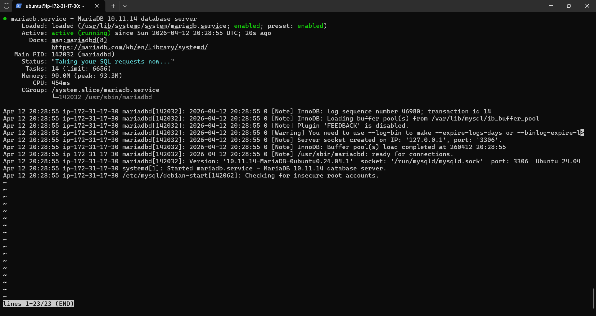
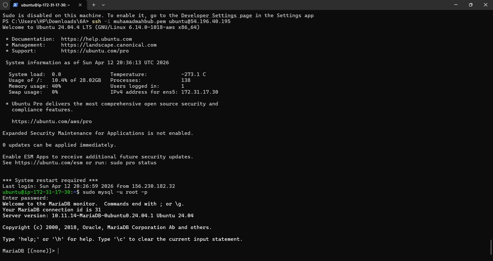

1. Aktifkan Instance AWs Ec2
2. Remote Instance Via Open SSH Powershell / putty
3. Patching OS (sudo apt-get update && sudo apt-get upgrade)
4. Install MariaDb (sudo apt install mariadb-server -y)
5. Cek Status MariaDb (systemctl status mariadb)

6. Test Default Setting database server login sudo mysql -u root -p
