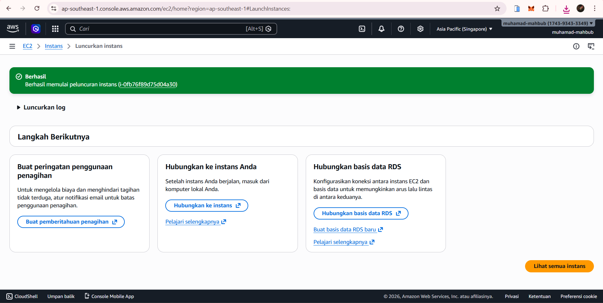
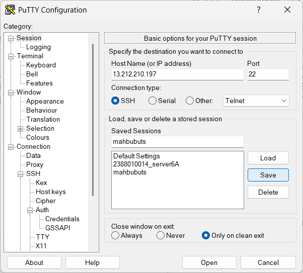
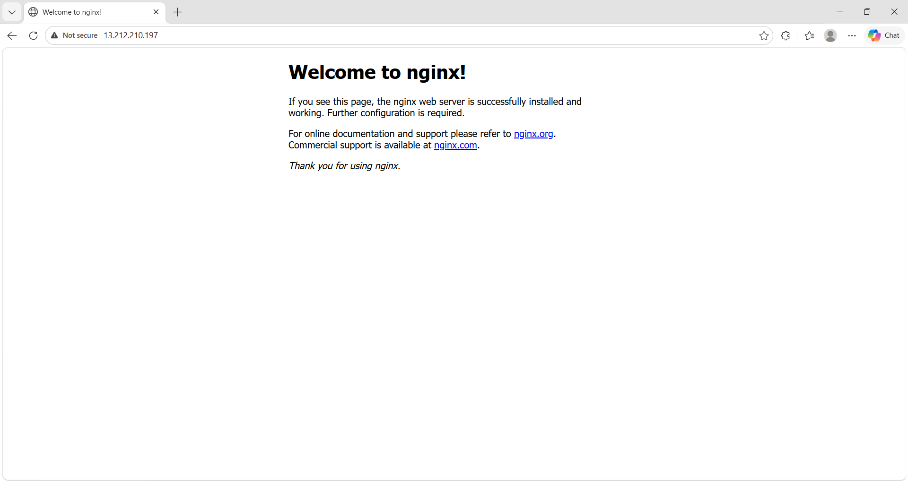
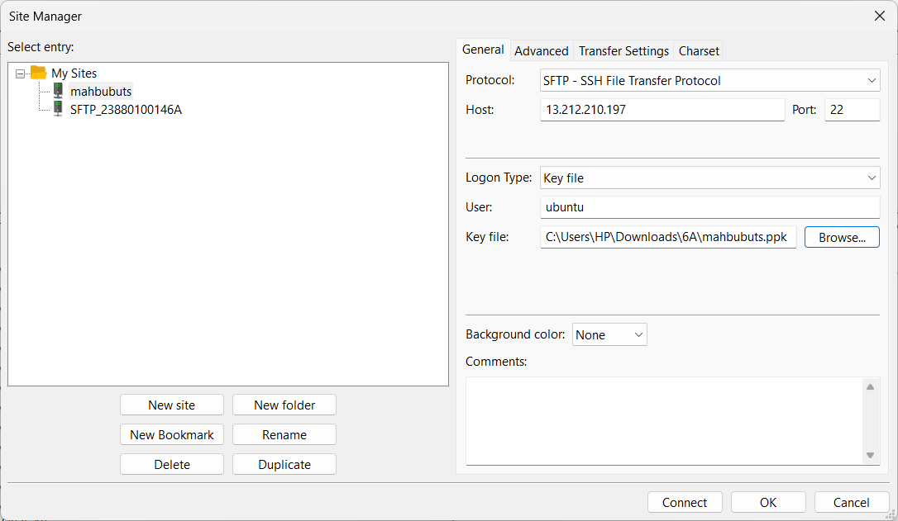
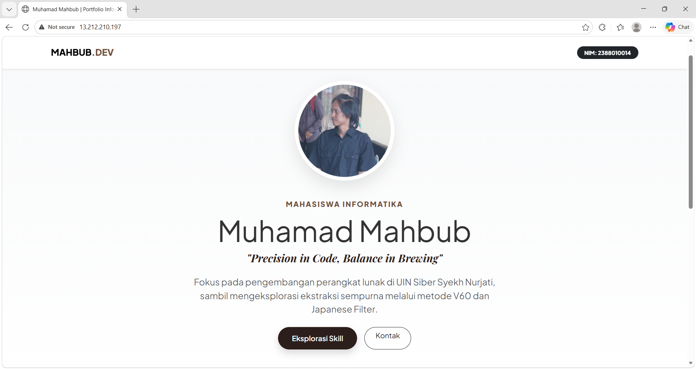
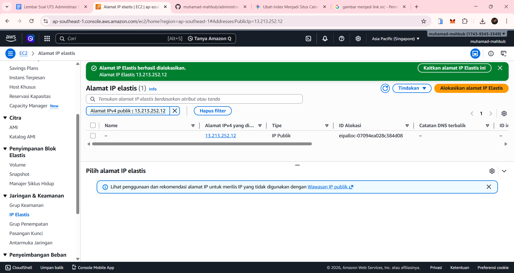
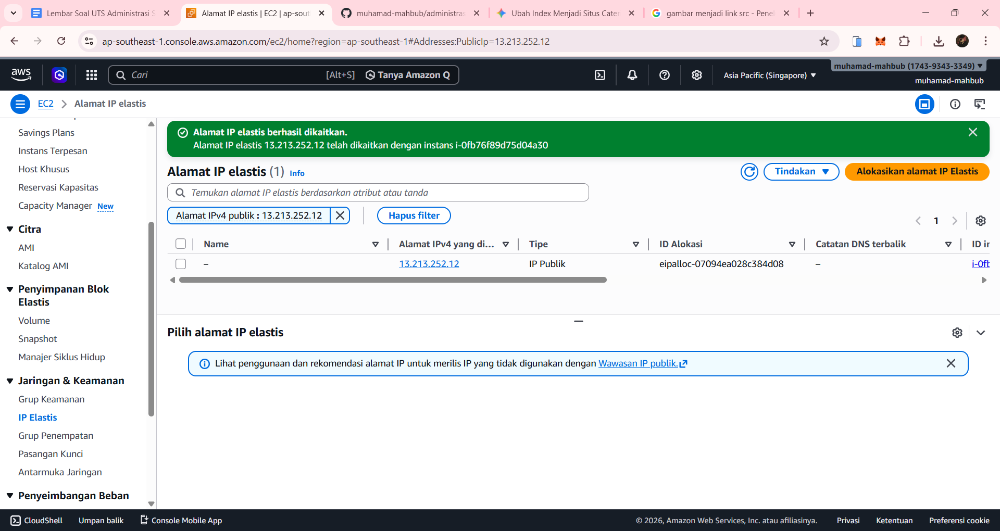
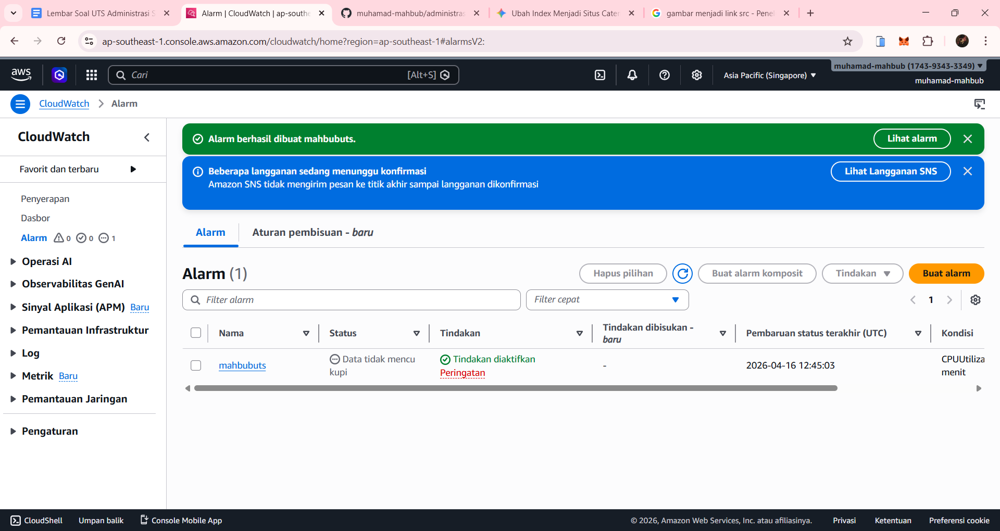

1. konfigurasi putty

2. set up putty membuat seision baru

3. nginx sudah berhasil di install

4. set up filzila membuat site baru

5. website berhasil di buat

6. membuat ip statik

7. mengaitkan ipstatik

8. membuat alarm
